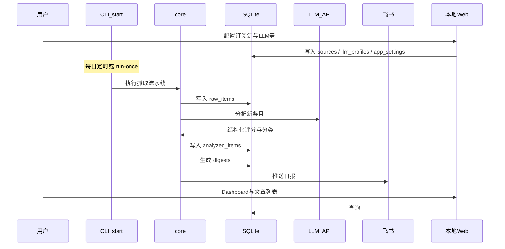
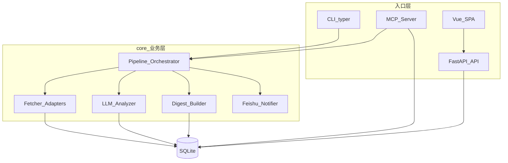
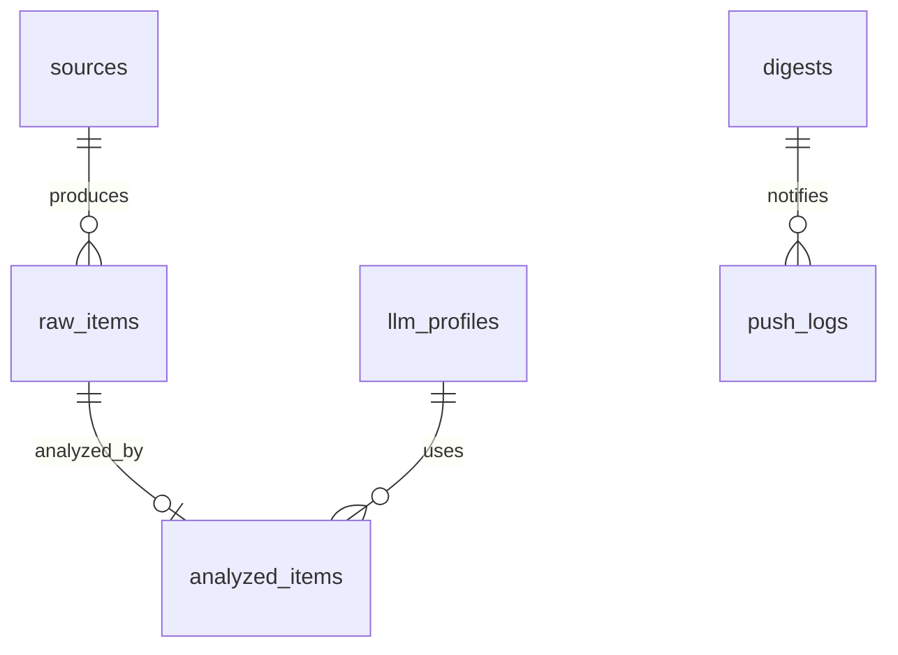

# Ddo-Pulse MVP 产品与技术规格

> 版本：1.0（产品规格与仓库版本号对齐）  
> 更新：2026-05-16  
> 状态：规格定稿，待开发

---

## 1. 产品概述

### 1.1 一句话

**Ddo-Pulse** 是一款轻量化的本机信息聚合工具：按用户配置定时抓取优质博客/平台内容，经可配置 LLM 筛选、分类与摘要后，通过飞书推送日报，并可在本地 Web 页面浏览历史 digest。

### 1.2 目标用户与价值

- **目标用户**：需要持续跟踪技术/行业前沿、但无暇逐站刷新的个人开发者或知识工作者。
- **核心价值**：自动化采集 → AI 降噪与分级 → 每日精选送达，降低信息获取成本。

### 1.3 设计原则


| 原则       | 说明                                                     |
| -------- | ------------------------------------------------------ |
| 轻量化      | 专注「抓取 → 分析 → 触达」，不引入独立数据库服务、分布式队列                      |
| 本机优先     | MVP 在本机（Windows）运行；架构预留 Docker 迁移                      |
| 专注信息聚合   | 项目长期只做采集、分析、推荐与触达，不扩展账号/权限等周边能力                        |
| 配置本地化    | 用户数据目录 `**~/.ddo_pulse`**（跨平台，见 12.6）；SQLite + 可编辑配置文件 |
| 凭证不进环境变量 | 所有配置通过 Web / CLI / 配置文件修改，**不使用 `.env` 环境变量**          |
| 核心复用     | `services/` 仅 **web** + **backend** 两端；Python 模块在 `backend/` 内分包 |


---

## 2. 决策记录

以下为用户已确认项；文档其余章节按此展开。形态对比见第 5、6 节供回顾。


| 决策项    | 选择                                                | 确认日期       |
| ------ | ------------------------------------------------- | ---------- |
| 产品形态   | **C. 混合**：`backend/core` + CLI + 可选 MCP；`web` 独立前端端 | 2026-05-16 |
| 仓库架构   | **`services/web`** + **`services/backend`**（见 §13）        | 2026-05-16 |
| 信息展示   | **飞书推送 + 本地 Web**（Dashboard、文章浏览、配置管理）            | 2026-05-16 |
| 配置方式   | **Web / CLI / `~/.ddo_pulse/config.yaml`**，不用环境变量 | 2026-05-16 |
| 数据目录   | `**~/.ddo_pulse**`（Windows / macOS 均适配）           | 2026-05-16 |
| 存储     | **SQLite**（`~/.ddo_pulse/ddo_pulse.db`）           | 需求明确       |
| 需登录站点  | **MVP 支持**：Playwright 复用本机浏览器会话；**不在工具内存 Cookie** | 2026-05-16 |
| 运行时    | **Python 3.11+**                                  | 2026-05-16 |
| 部署     | **本机**（`start` / 任务计划）；Docker 为 P1                | 2026-05-16 |
| LLM 网关 | **OpenRouter**                                    | 2026-05-16 |
| 前端     | **Vue 3 + Vite**                                  | 2026-05-16 |


---

## 3. MVP 边界

### 3.1 MVP 包含

- **明确支持的抓取类型**（见第 7 节）：RSS/Atom、JSON Feed、HTML 列表页、**本机浏览器会话页**（MVP）；P1 扩展 Sitemap、公开 API
- 可配置 LLM：质量评分、分类、中文推荐摘要
- 每日 digest 聚合 + 飞书推送
- **本地 Web**：Dashboard、过往文章列表、文章详情（外链原文）、**配置管理**
- 配置入口：**Web / CLI / 直接编辑 `~/.ddo_pulse/config.yaml`**（三者等价写入 SQLite）
- MCP Server（`services/backend/mcp` 薄封装）：查询摘要、触发抓取、列出订阅源等
- CLI：`start` / `stop` / `health`、`run-once`、`source` / `profile` / `config` 子命令

### 3.2 MVP 不包含（范围外能力）


| 类别                  | 说明                                        |
| ------------------- | ----------------------------------------- |
| 无配置的整站 SPA 爬取       | 未提供列表选择器的全站渲染爬取，不做                        |
| 在配置中填写 Cookie/Token | 凭证不进 Ddo-Pulse；登录态仅通过本机浏览器 Profile（见 7.4） |
| 社交平台时间线             | X、微博等                                     |
| 邮件 Newsletter       | IMAP 收信                                   |
| 分布式任务编排             | Celery、Kafka 等                            |
| 独立数据库服务             | MySQL、Postgres、Redis                      |


### 3.3 Web 页面（MVP）


| 页面            | 路径（示例）           | 功能                                      |
| ------------- | ---------------- | --------------------------------------- |
| **Dashboard** | `/`              | 今日/近期 digest 摘要、抓取与分析任务状态、源数量、待读优质文章数   |
| **过往文章列表**    | `/articles`      | 按日期、分类、来源、评分筛选；分页                       |
| **文章详情**      | `/articles/{id}` | 标题、LLM 摘要、评分、分类、**原文链接**（新标签打开）         |
| **配置管理**      | `/settings`      | 订阅源、LLM Profile、飞书 Webhook、调度周期、导入/导出配置 |


配置管理页与 CLI、`config.yaml` 修改同一份数据，无「只读 Web」限制。

---

## 4. 用户故事

### 4.1 主流程




### 4.2 典型场景

1. **首次使用**：`ddo-pulse init`（创建 `~/.ddo_pulse`）→ Web `/settings` 或编辑 `~/.ddo_pulse/config.yaml` → 添加订阅源 → `run-once` 验证。
2. **日常使用**：`ddo-pulse start` 常驻或任务计划 `run-once`；飞书收日报；Vue Dashboard 回顾与筛选文章。
3. **在 Cursor 中**：MCP 调用 `get_today_digest`、`trigger_fetch`。

---

## 5. 产品形态分析（已选 C，保留对比）

### 5.1 方案对比


| 形态                | 说明                             | 优势               | 劣势               |
| ----------------- | ------------------------------ | ---------------- | ---------------- |
| **A. MCP Server** | 向 Cursor 等暴露 tools             | AI 工作流集成好        | 定时调度需另配；推送逻辑仍要后台 |
| **B. CLI / 守护进程** | `run-once` / `daemon` + 系统任务计划 | 定时、批处理、飞书路径直接    | 无对话式入口           |
| **C. 混合（已选）**     | core + CLI 调度推送 + MCP 薄封装      | 兼顾自动化与 Cursor 调用 | 模块略多，但 core 只写一份 |


### 5.2 混合架构下的职责划分


| 端 / 目录 | 职责 |
|-----------|------|
| **`services/web`** | Vue 3 前端：Dashboard、文章、配置管理 |
| **`services/backend`** | 全部 Python：`cli` 命令、`core` 业务、`api` REST、`mcp`、`db` |

`backend` 内部依赖：`cli`/`mcp` → `core` → `db`；`api` → `core`, `db`。`web` → `backend/api`。


### 5.3 演进路径

```text
Phase MVP:  services/backend（core → cli → api → mcp）+ services/web
Phase P1:   Docker、Sitemap/API 适配器
Phase P2:   更多站点插件、飞书开放平台能力扩展
```

---

## 6. 信息展示方案（已选：飞书 + Web）

### 6.1 飞书（主动触达）

- 渠道：群机器人 **Incoming Webhook**（MVP 最快落地）。
- 内容：当日 Top N 优质文章（默认 N=8，`score >= threshold`）。
- 形态：交互卡片或富文本 post；字段含分类标签、标题（外链）、推荐语、评分。

### 6.2 本地 Web

- 绑定：`127.0.0.1`（端口在 `**~/.ddo_pulse/config.yaml`** 的 `app.web_port`，默认 `8765`）。
- 页面职责见 **3.3**：Dashboard、过往文章列表、文章详情、配置管理。
- 技术栈：**Vue 3 + Vite** 前端，`api/` 提供 REST；生产环境由 API 托管前端静态构建产物。
- 启动：执行 `**ddo-pulse start`**（调度 + API + Web 一并拉起，见 10.1）。

### 6.3 方案对比（备查）


| 方案           | 工作量 | 适用          |
| ------------ | --- | ----------- |
| 仅飞书          | 低   | 只需被动阅读      |
| 仅 Web        | 中   | 不习惯飞书、需本地归档 |
| 飞书 + Web（已选） | 中高  | 推送 + 回顾兼顾   |


---

## 7. 支持抓取的内容源（明确清单）

用户在添加订阅源时，选择 **「从哪种地址抓取」**，对应下表。实现层用 `sources.type` 区分适配器。

### 7.1 MVP 已支持的抓取类型


| 用户侧名称                 | `type`            | 你需要提供的地址                      | 工具如何抓                                             | 典型示例                                   |
| --------------------- | ----------------- | ----------------------------- | ------------------------------------------------- | -------------------------------------- |
| **从 RSS/Atom 订阅地址抓取** | `rss`             | Feed URL                      | 解析 XML 条目：标题、链接、摘要、时间                             | `https://blog.example.com/feed.xml`    |
| **从 JSON Feed 地址抓取**  | `json_feed`       | JSON Feed URL                 | 解析 JSON 条目（逻辑同 RSS）                               | `https://blog.example.com/feed.json`   |
| **从网页列表 URL 抓取**      | `html_list`       | 博客/专栏**列表页** URL + CSS 选择器    | `httpx` 请求 HTML，按选择器提取条目                          | `https://company.com/engineering/blog` |
| **从本机已登录浏览器抓取列表页**    | `browser_session` | 需登录才能访问的**列表页** URL + CSS 选择器 | Playwright 加载**本机浏览器用户目录**，复用已有登录态，再按选择器提取（见 7.4） | 知乎专栏、掘金个人页等                            |


说明：

- **RSS 与 JSON Feed** 是最推荐方式：稳定、省流量、无需登录。
- **网页列表 URL** 适用于公开页面；配置 `list_url` 与 `selectors`（见 7.6）。
- `**browser_session`** 适用于必须登录的列表页；**不在配置里填 Cookie**，由本机 Chrome/Edge 用户数据目录提供会话（见 7.4）。
- 添加 `html_list` 源时，可**自动探测** RSS `<link rel="alternate">`，若发现则建议改为 `rss`。

### 7.2 计划支持（非 MVP，仅列于路线图）


| 用户侧名称              | `type`      | 地址                | 说明                            |
| ------------------ | ----------- | ----------------- | ----------------------------- |
| **从 Sitemap 地址抓取** | `sitemap`   | `sitemap.xml` URL | 解析站点地图中的 URL，再取新文章            |
| **从平台公开 API 抓取**   | `api`       | API 根地址或模板        | 如 Hacker News、GitHub Releases |
| **从单篇文章 URL 抓取**   | `html_page` | 单页 URL            | 监控某一固定页面更新；P1                 |
| **站点定制插件**         | `plugin`    | 视插件而定             | 少数派、InfoQ 等固定结构站点，P2          |


### 7.3 明确不支持（MVP）


| 类型                                     | 原因                          |
| -------------------------------------- | --------------------------- |
| 未配置选择器的整站 SPA 爬取                       | 无列表规则的全站渲染抓取                |
| 社交平台时间线（X、微博等）                         | 非博客聚合范畴                     |
| 邮件 Newsletter（IMAP）                    | 非 HTTP 抓取                   |
| **在 Ddo-Pulse 配置/数据库中填写 Cookie、Token** | 与产品约定冲突；登录态只来自本机浏览器 Profile |


### 7.4 登录态：本机浏览器会话（MVP 包含）

**产品约定：**

- Ddo-Pulse **不在** `config.yaml`、SQLite 或 Web 配置页中存储、编辑 Cookie/Token/密码。
- 对**必须登录才能看到列表**的站点，MVP 通过订阅源类型 `**browser_session`** 抓取：使用 **Playwright** 启动浏览器上下文，并加载用户本机已登录的 **浏览器用户数据目录（User Data）**，由 Chrome/Edge 等浏览器自身管理登录态。

**实现要点（MVP）：**


| 项      | 说明                                                                       |
| ------ | ------------------------------------------------------------------------ |
| 适配器    | `services/backend/core/.../fetchers/browser_session.py`                    |
| 依赖     | `playwright`；首次需 `playwright install chromium`（或使用系统已安装的 Chrome channel） |
| 用户数据目录 | 配置项 `browser_profile`：`chrome` / `edge` / 或自定义路径；默认按 OS 探测常见路径（见 7.4.1）  |
| 列表解析   | 与 `html_list` 相同：在 `config_json` 中配置 `selectors`                         |
| 注意     | 抓取时**不宜**与正在使用该 Profile 的浏览器同时独占同一目录；文档提示用户抓取期间关闭对应浏览器，或复制 Profile（P1）   |


**与「不维护凭证」的关系：** 不冲突。凭证留在浏览器 Profile 内，工具只**读取渲染后的页面 DOM**，不在应用侧持久化 Cookie。

#### 7.4.1 默认浏览器用户数据路径（供实现参考）


| 系统      | Chrome（示例）                                    |
| ------- | --------------------------------------------- |
| Windows | `%LOCALAPPDATA%\Google\Chrome\User Data`      |
| macOS   | `~/Library/Application Support/Google/Chrome` |


实现时使用 `pathlib.Path.home()` 及 OS 判断解析；**禁止**将 `~` 硬编码为某一平台路径。Edge 等浏览器在设置中可切换 `browser_profile`。

#### 7.4.2 `browser_session` 源配置示例

```json
{
  "list_url": "https://example.com/column",
  "browser_profile": "chrome",
  "selectors": {
    "item": ".article-item",
    "title": "a.title",
    "link": "a.title@href",
    "date": ".date"
  },
  "headless": true,
  "wait_for": ".article-item"
}
```

### 7.5 抓取流水线原则

1. **RSS 优先**：对 `html_list` 源，可先请求列表页探测 RSS `<link rel="alternate">`，发现则建议用户改用 `rss`。
2. **统一中间模型** `RawItem`：

```python
# 逻辑结构（实现时可用 dataclass / pydantic）
RawItem:
  source_id: int
  url: str          # 归一化后唯一
  title: str
  published_at: datetime | None
  content_snippet: str   # 摘要或正文前 N 字
  fetched_at: datetime
```

1. **去重**：`raw_items.url` UNIQUE；URL 归一化（去 fragment、统一 scheme/host）。
2. **礼貌抓取**：User-Agent 标识、请求间隔（默认同源 1s）、超时 30s、失败记入日志不阻断其他源。

### 7.6 HTML 列表源配置示例（`type=html_list`）

```json
{
  "list_url": "https://example.com/blog/",
  "selectors": {
    "item": "article.post",
    "title": "h2 a",
    "link": "h2 a@href",
    "date": "time@datetime"
  },
  "fetch_detail": false
}
```

`fetch_detail: true` 时进入详情页取正文（LLM 成本更高，默认 false，仅用列表摘要）。

---

## 8. 系统架构

### 8.1 组件图




### 8.2 单次 `run-once` 流水线

```text
1. load enabled sources
2. for each source: adapter.fetch() -> upsert raw_items (new only)
3. for each new raw_item: analyzer.run(profile) -> analyzed_items
4. build digest for today (filter score >= threshold, top N)
5. if not pushed today (or --force): feishu.send(digest)
6. write push_logs
```

---

## 9. 技术栈


| 模块     | 选型                                                | 说明                                                                         |
| ------ | ------------------------------------------------- | -------------------------------------------------------------------------- |
| 语言     | Python 3.11+                                      | 抓取生态成熟，`sqlite3` 标准库                                                       |
| HTTP   | `httpx`                                           | MVP 同步即可                                                                   |
| RSS    | `feedparser`                                      | P0                                                                         |
| HTML   | `beautifulsoup4` + `lxml`                         | 通用列表解析                                                                     |
| 浏览器会话  | `playwright`                                      | `browser_session` 源，复用本机登录态                                                |
| LLM    | **OpenRouter**（经 `openai` SDK 或 `openrouter` SDK） | 统一网关，见 10.3、[OpenRouter Quickstart](https://openrouter.ai/docs/quickstart) |
| CLI    | `typer`                                           | 子命令                                                                        |
| 调度     | `apscheduler`（由 `start` 拉起）或系统任务计划 + `run-once`   |                                                                            |
| 后端 API | `fastapi`                                         | REST，供 Vue 消费                                                              |
| 前端     | **Vue 3 + Vite + Vue Router**（可选 Pinia）           | `services/web/frontend/`                                                 |
| MCP    | `mcp` 官方 Python SDK                               | 薄封装                                                                        |
| 校验     | `pydantic`                                        | 配置与 LLM 输出 JSON                                                            |


---

## 10. 功能规格

### 10.1 CLI 命令（MVP）

#### 生命周期（必备）


| 命令                     | 说明                                                                            |
| ---------------------- | ----------------------------------------------------------------------------- |
| `**ddo-pulse start`**  | 启动本机服务：APScheduler + FastAPI（REST + Vue 静态资源）；写入 `~/.ddo_pulse/ddo-pulse.pid` |
| `**ddo-pulse stop**`   | 根据 pid 文件优雅停止上述进程                                                             |
| `**ddo-pulse health**` | 健康检查，输出 JSON/表格（见下表）                                                          |


`**health` 检查项：**


| 项            | 说明                                                                                        |
| ------------ | ----------------------------------------------------------------------------------------- |
| `process`    | pid 文件存在且进程存活（`start` 后应为 ok）                                                             |
| `database`   | SQLite 可连接、`schema` 版本正确                                                                  |
| `config`     | `~/.ddo_pulse` 存在且 `config.yaml` / DB 中 OpenRouter、飞书已配置（脱敏）                              |
| `browser`    | 可选：`playwright` 可用；`browser_profile` 路径存在（仅当存在 `browser_session` 源时）                      |
| `scheduler`  | 上次 `job_runs` 时间与状态                                                                       |
| `openrouter` | 可选：对 `GET https://openrouter.ai/api/v1/models` 或最小 `chat/completions` 探测（失败记 warning，不阻断） |
| `api`        | `GET http://{web_host}:{web_port}/api/health` 返回 200                                      |


#### 其他命令


| 命令                                            | 说明                                                 |
| --------------------------------------------- | -------------------------------------------------- |
| `ddo-pulse init`                              | 创建 `**~/.ddo_pulse`**、初始化 SQLite 与默认 `config.yaml` |
| `ddo-pulse source add|list|rm|enable|disable` | 管理订阅源                                              |
| `ddo-pulse profile add|list|set-default`      | 管理 LLM Profile（OpenRouter）                         |
| `ddo-pulse run-once [--force-push]`           | 立即执行完整流水线一次（不依赖 `start`）                           |
| `ddo-pulse config show|set|import|export`     | 查看/修改/导入/导出 `~/.ddo_pulse/config.yaml`             |
| `ddo-pulse mcp`                               | 启动 MCP Server（stdio），与 `start` 独立                  |


> `daemon` / `web` 不再作为用户面向命令；能力合并进 **`start` / `stop`**。开发阶段可分别启动 `services/backend/api` 与 `cd services/web/frontend && npm run dev`（Vite 代理 `/api`）。

### 10.2 MCP Tools（MVP）


| Tool               | 参数                     | 行为                       |
| ------------------ | ---------------------- | ------------------------ |
| `list_sources`     | —                      | 返回已配置订阅源                 |
| `trigger_fetch`    | `source_id?`           | 触发抓取；省略则全部 enabled 源     |
| `get_today_digest` | —                      | 返回今日 digest 文本（Markdown） |
| `get_recent_items` | `days=7`, `min_score?` | 返回近期 analyzed_items 摘要   |


实现要求：**仅调用 `services/backend/core`**，不重复业务逻辑。

### 10.3 LLM：经 OpenRouter 接入

MVP **统一经 [OpenRouter](https://openrouter.ai/) 中转** 调用各类模型，不直连单一厂商 API。接入方式遵循官方 [Quickstart](https://openrouter.ai/docs/quickstart)。

#### 10.3.1 OpenRouter 接入要点


| 项                    | 值 / 说明                                                                                                                                         |
| -------------------- | ---------------------------------------------------------------------------------------------------------------------------------------------- |
| **Base URL**         | `https://openrouter.ai/api/v1`                                                                                                                 |
| **Chat Completions** | `POST /chat/completions`（与 OpenAI 兼容）                                                                                                          |
| **鉴权**               | Header：`Authorization: Bearer <OPENROUTER_API_KEY>`                                                                                            |
| **模型 ID**            | OpenRouter 格式：`{provider}/{model}`，如 `openai/gpt-4o-mini`、`anthropic/claude-sonnet-4`（可在 [OpenRouter Models](https://openrouter.ai/models) 选用） |
| **可选 Header**        | `HTTP-Referer`：应用站点 URL；`X-OpenRouter-Title`：应用名称（用于 OpenRouter 排行榜展示，可选）                                                                      |


**推荐实现（Python）：** 使用 **OpenAI SDK** 指向 OpenRouter（官方文档「Using the OpenAI SDK」），无需改调用结构：

```python
from openai import OpenAI

client = OpenAI(
    base_url="https://openrouter.ai/api/v1",
    api_key="<从配置读取 OPENROUTER_API_KEY>",
)
completion = client.chat.completions.create(
    extra_headers={
        "HTTP-Referer": "<app.site_url>",      # 可选，来自配置
        "X-OpenRouter-Title": "Ddo-Pulse",     # 可选
    },
    model="openai/gpt-4o-mini",                # OpenRouter 模型 ID
    messages=[{"role": "user", "content": "..."}],
)
```

亦可使用官方 `pip install openrouter` 客户端；MVP 任选其一，**请求路径与字段以 OpenRouter 文档为准**。

分析流水线使用 **Chat Completions + JSON 输出**（在 Prompt 中约束 JSON）；若模型支持 `response_format`，P1 可再收紧。

#### 10.3.2 Profile 配置字段

存储于 `llm_profiles` 表；可通过 Web `/settings`、CLI 或 `~/.ddo_pulse/config.yaml` 修改。


| 字段                | 说明                                                        |
| ----------------- | --------------------------------------------------------- |
| `name`            | 配置名，如 `default`                                           |
| `provider`        | 固定 `openrouter`                                           |
| `base_url`        | 默认 `https://openrouter.ai/api/v1`（一般无需改）                  |
| `api_key`         | **OpenRouter API Key**；存 SQLite / yaml，勿提交 git            |
| `model`           | OpenRouter 模型 ID，如 `openai/gpt-4o-mini`                   |
| `site_url`        | 可选，对应 `HTTP-Referer`                                      |
| `app_title`       | 可选，对应 `X-OpenRouter-Title`，默认 `Ddo-Pulse`                 |
| `temperature`     | 默认 0.3                                                    |
| `max_tokens`      | 默认 1024                                                   |
| `prompt_template` | 分析 Prompt，占位符 `{title}`, `{content}`, `{categories_hint}` |
| `score_threshold` | 进入 digest 的最低分，默认 7                                       |
| `category_hints`  | JSON 数组，如 `["AI","工程","产品","安全"]`                         |


### 10.4 LLM 分析流水线

**Step 1 — Normalize**

- 剥离 HTML 标签；截断至 8000 字符（可配置）。

**Step 2 — Score & Classify**

- 要求模型 **仅输出 JSON**（失败重试 1 次）：

```json
{
  "is_quality": true,
  "score": 8,
  "categories": ["AI", "工程"],
  "summary_zh": "一文读懂某某架构的演进路径……",
  "reason": "对实践有具体案例，非泛泛而谈"
}
```

**Step 3 — Digest Aggregate**

- 筛选：`is_quality == true` 且 `score >= score_threshold`
- 按 `score` 降序取 Top N（默认 8）
- 生成 `digests.markdown_body` 供飞书与 Web 共用

### 10.5 成本控制

- 仅对 **新** `raw_items` 调用 LLM
- 默认只用 `content_snippet`（RSS description 或列表摘要）
- `fetch_detail: true` 的源才请求详情页正文
- 可配置每日 LLM 调用上限（P1，MVP 可先记录 token 日志）

### 10.6 飞书推送

- **接入**：自定义机器人 Webhook URL，存于 `app_settings.feishu_webhook`（Web/CLI/`config.yaml` 配置）
- **幂等**：`push_logs` 按 `digest.date` 查重；`run-once --force-push` 可重复发送
- **重试**：失败最多 3 次，指数退避 1s / 2s / 4s
- **卡片字段**：日期标题、分类标签、文章标题（链接）、`summary_zh`、评分

---

## 11. SQLite 数据模型

文件路径：`**~/.ddo_pulse/ddo_pulse.db`**（用户主目录下，不进入项目 git 仓库）。

### 11.1 ER 关系（逻辑）




### 11.2 表结构

#### `sources`


| 列           | 类型         | 说明                                                                                |
| ----------- | ---------- | --------------------------------------------------------------------------------- |
| id          | INTEGER PK |                                                                                   |
| name        | TEXT       | 显示名                                                                               |
| type        | TEXT       | `rss` | `json_feed` | `html_list` | `browser_session` | `sitemap`（P1） | `api`（P1） |
| url         | TEXT       | 入口 URL                                                                            |
| config_json | TEXT       | 适配器参数 JSON                                                                        |
| enabled     | INTEGER    | 0/1                                                                               |
| fetch_cron  | TEXT       | 可选 cron；`start` 内 APScheduler 用                                                   |
| created_at  | TEXT       | ISO8601                                                                           |


#### `llm_profiles`


| 列               | 类型          | 说明                                      |
| --------------- | ----------- | --------------------------------------- |
| id              | INTEGER PK  |                                         |
| name            | TEXT UNIQUE |                                         |
| provider        | TEXT        | 固定 `openrouter`                         |
| base_url        | TEXT        | 默认 `https://openrouter.ai/api/v1`       |
| model           | TEXT        | OpenRouter 模型 ID，如 `openai/gpt-4o-mini` |
| api_key         | TEXT        | OpenRouter API Key                      |
| site_url        | TEXT        | 可选，`HTTP-Referer`                       |
| app_title       | TEXT        | 可选，`X-OpenRouter-Title`                 |
| temperature     | REAL        |                                         |
| max_tokens      | INTEGER     |                                         |
| prompt_template | TEXT        |                                         |
| score_threshold | INTEGER     |                                         |
| category_hints  | TEXT        | JSON 数组                                 |
| is_default      | INTEGER     | 0/1                                     |


#### `raw_items`


| 列               | 类型          | 说明      |
| --------------- | ----------- | ------- |
| id              | INTEGER PK  |         |
| source_id       | INTEGER FK  |         |
| url             | TEXT UNIQUE | 归一化 URL |
| title           | TEXT        |         |
| published_at    | TEXT        | 可空      |
| content_snippet | TEXT        |         |
| fetched_at      | TEXT        |         |


#### `analyzed_items`


| 列               | 类型                | 说明   |
| --------------- | ----------------- | ---- |
| id              | INTEGER PK        |      |
| raw_item_id     | INTEGER FK UNIQUE | 每篇一条 |
| profile_id      | INTEGER FK        |      |
| is_quality      | INTEGER           | 0/1  |
| score           | INTEGER           | 1-10 |
| categories_json | TEXT              |      |
| summary_zh      | TEXT              |      |
| reason          | TEXT              |      |
| analyzed_at     | TEXT              |      |


#### `digests`


| 列             | 类型          | 说明                  |
| ------------- | ----------- | ------------------- |
| id            | INTEGER PK  |                     |
| date          | TEXT UNIQUE | `YYYY-MM-DD`        |
| item_ids_json | TEXT        | analyzed_item id 列表 |
| markdown_body | TEXT        |                     |
| created_at    | TEXT        |                     |


#### `push_logs`


| 列         | 类型         | 说明              |
| --------- | ---------- | --------------- |
| id        | INTEGER PK |                 |
| digest_id | INTEGER FK |                 |
| channel   | TEXT       | `feishu`        |
| status    | TEXT       | `ok` | `failed` |
| response  | TEXT       |                 |
| pushed_at | TEXT       |                 |


#### `job_runs`（可选，便于排错）


| 列           | 类型         | 说明  |
| ----------- | ---------- | --- |
| id          | INTEGER PK |     |
| started_at  | TEXT       |     |
| finished_at | TEXT       |     |
| status      | TEXT       |     |
| error       | TEXT       |     |


---

## 12. 配置管理

### 12.1 原则

- **不使用环境变量**承载业务配置（无 `.env` 依赖）。
- 所有配置可通过三种方式修改，写入同一数据源：
  1. **Web** → `/settings` 及各子页
  2. **CLI** → `ddo-pulse source|profile|config` 子命令
  3. **直接编辑文件** → `~/.ddo_pulse/config.yaml`（保存后 `config import` 或 `start` 时同步进 SQLite）

运行时以 **SQLite 为权威**；`config.yaml` 与数据库均位于用户主目录，便于备份与手工编辑。

### 12.2 用户数据目录 `~/.ddo_pulse`

所有运行时文件集中在用户主目录下的 `**.ddo_pulse`** 文件夹（注意：项目名 `ddo-pulse`，目录名 `ddo_pulse`）。


| 文件     | 路径                           |
| ------ | ---------------------------- |
| 配置文件   | `~/.ddo_pulse/config.yaml`   |
| 数据库    | `~/.ddo_pulse/ddo_pulse.db`  |
| 进程 pid | `~/.ddo_pulse/ddo-pulse.pid` |
| 日志（可选） | `~/.ddo_pulse/logs/`         |


#### 12.2.1 跨平台路径解析

文档中的 `**~**` 表示当前用户主目录，实现时**必须**使用标准库解析，以同时适配 Windows 与 macOS（及 Linux）：

```python
from pathlib import Path

DATA_DIR = Path.home() / ".ddo_pulse"   # 勿手写 %USERPROFILE% 或 /Users/xxx
```


| 平台      | `Path.home()` 示例 | 数据目录示例                      |
| ------- | ---------------- | --------------------------- |
| Windows | `C:\Users\Alice` | `C:\Users\Alice\.ddo_pulse` |
| macOS   | `/Users/Alice`   | `/Users/Alice/.ddo_pulse`   |


`ddo-pulse init` 若目录不存在则创建；`config.yaml` 中 `app.data_dir` 可省略（默认即上表），仅在需要自定义路径时填写**绝对路径**。

### 12.3 配置文件 `~/.ddo_pulse/config.yaml`

`ddo-pulse init` 生成默认模板。示例结构：

```yaml
app:
  # data_dir 省略则使用 Path.home() / ".ddo_pulse"
  web_host: 127.0.0.1
  web_port: 8765
  log_level: INFO
  db_path: ddo_pulse.db              # 相对 data_dir 的文件名
  fetch_schedule_cron: "0 8 * * *"   # start 后由 APScheduler 执行

browser:
  default_profile: chrome            # chrome | edge | 或绝对路径

feishu:
  webhook_url: ""                    # 飞书机器人 Webhook

llm:
  default_profile: default
  profiles:
    - name: default
      provider: openrouter
      base_url: https://openrouter.ai/api/v1
      api_key: ""                    # OpenRouter API Key，勿提交 git
      model: openai/gpt-4o-mini      # 见 https://openrouter.ai/models
      site_url: http://127.0.0.1:8765   # 可选，HTTP-Referer
      app_title: Ddo-Pulse           # 可选，X-OpenRouter-Title
      temperature: 0.3
      max_tokens: 1024
      score_threshold: 7
      category_hints: [AI, 工程, 产品, 安全]
      prompt_template: |             # 可省略则用内置默认
        ...

sources:                             # 也可仅在 Web/CLI 维护，存 SQLite
  - name: 示例博客
    type: rss
    url: https://example.com/feed.xml
    enabled: true
```

**同步规则：**

- 启动时：若 `config.yaml` 新于 DB 或指定 `--config-import`，则导入覆盖对应表。
- Web/CLI 修改后：写 SQLite，并可选 `--export-config` 回写 yaml。
- 用户数据在 `**~/.ddo_pulse`**，与项目仓库分离，**无需**也不应提交到 git。

### 12.4 Web 配置管理（`/settings`）


| 区块              | 内容                                                                                                    |
| --------------- | ----------------------------------------------------------------------------------------------------- |
| 订阅源             | 增删改查；类型含 rss / json_feed / html_list / **browser_session**；`browser_session` 可配 `browser_profile`、选择器 |
| LLM（OpenRouter） | API Key、模型 ID（下拉或手填）、Referer/Title、Prompt、阈值、分类标签                                                     |
| 飞书              | Webhook URL、测试推送                                                                                      |
| 调度              | `fetch_schedule_cron`、手动「立即抓取」                                                                        |
| 高级              | 导入/导出 `config.yaml`、打开配置文件路径提示                                                                        |


### 12.5 CLI 配置命令


| 命令                         | 说明                                      |
| -------------------------- | --------------------------------------- |
| `config show`              | 打印当前生效配置（脱敏 api_key）                    |
| `config set <key> <value>` | 修改 `app_settings` 单项                    |
| `config import`            | 从 `~/.ddo_pulse/config.yaml` 导入 SQLite  |
| `config export`            | 从 SQLite 导出到 `~/.ddo_pulse/config.yaml` |


### 12.6 `app_settings` 表（键值补充）

用于未归入 `sources` / `llm_profiles` 的全局项，如 `feishu.webhook_url`、`app.web_port`。实现时可与 yaml 顶层字段双向映射。

---

## 13. 项目目录结构

`services/` 仅划分 **两端**（与 file-index 的 `AGENTS.md` 对应）：

| 端 | 目录 | 说明 |
|----|------|------|
| **Web 端** | `services/web/` | Vue 3 + Vite |
| **后端** | `services/backend/` | 全部 Python（不用 `py` 作目录名） |

```text
ddo_pulse/
├── docs/
│   ├── mvp.md
│   ├── feat/
│   └── fix/
├── services/
│   ├── web/                        # Web 端
│   │   ├── AGENTS.md
│   │   └── frontend/               # Vue 3 + Vite
│   │       ├── package.json
│   │       ├── vite.config.ts
│   │       └── src/
│   │           ├── views/
│   │           ├── api/
│   │           └── router/
│   ├── backend/                    # 后端（Python）
│   │   ├── AGENTS.md
│   │   ├── cli/ddo_pulse_cli/      # init, start, stop, health, run-once
│   │   ├── core/ddo_pulse_core/    # 抓取、分析、digest、飞书
│   │   │   ├── pipeline.py
│   │   │   ├── fetchers/
│   │   │   ├── analyzer/
│   │   │   └── notifier/
│   │   ├── api/ddo_pulse_api/      # FastAPI → 供 web 调用
│   │   ├── mcp/ddo_pulse_mcp/
│   │   └── db/                     # schema.sql + ddo_pulse_db/
│   └── README.md
├── SERVICES_INDEX.md
├── skills/
└── pyproject.toml                  # CLI 入口 → services/backend/cli
```

**依赖关系：**

```text
services/web  ──HTTP──►  services/backend/api  ──►  core  ──►  db
services/backend/cli / mcp  ─────────────────────────►  core  ──►  db
```

**前后端协作：**

- 开发：`backend/api` 监听 `8765`；`web/frontend` Vite（如 `5173`）代理 `/api`。
- 生产 / `ddo-pulse start`：Vue 构建 `dist`，由 `backend/api` 托管。

**用户数据（不在仓库内）：** `~/.ddo_pulse/`，见 12.2、12.2.1。

**文档维护：**

- 新功能说明 → `docs/feat/YYYY-MM-DD-描述.md`
- Bug 修复说明 → `docs/fix/YYYY-MM-DD-描述.md`

**Agent 导航：**

- 服务索引：[SERVICES_INDEX.md](../SERVICES_INDEX.md)（由 `skills/file-index` 维护）
- Web 端说明：[services/web/AGENTS.md](../services/web/AGENTS.md)
- 后端说明：[services/backend/AGENTS.md](../services/backend/AGENTS.md)

---

## 14. 部署与运行

### 14.1 本机（MVP）

**Windows 任务计划（推荐）**

1. `pip install -e .`
2. `ddo-pulse init`（生成 `~/.ddo_pulse/config.yaml` 与数据库）
3. 编辑 `~/.ddo_pulse/config.yaml` 或在 Web `/settings` 填写 LLM、飞书、订阅源
4. 日常运行：

```bash
ddo-pulse start    # 调度 + API + Vue 静态资源
ddo-pulse health   # 检查状态
ddo-pulse stop     # 停止服务
```

亦可仅用系统任务计划调用 `ddo-pulse run-once`（不常驻 `start`）。

### 14.2 Docker（P1 预留）

```dockerfile
# 要点（实现阶段再写完整 Dockerfile）
# - volume: ~/.ddo_pulse:/root/.ddo_pulse   # 挂载用户数据目录
# - command: ddo-pulse start
# - ports: 8765:8765  # 仅本机映射时 expose
```

---

## 15. 里程碑与验收


| 阶段      | 交付物                                           | 验收标准                                              |
| ------- | --------------------------------------------- | ------------------------------------------------- |
| **M1**  | SQLite schema + CLI 源管理 + RSS 抓取              | `run-once` 后 `raw_items` 有新行                      |
| **M2**  | LLM 分析落库                                      | 新文章有 `analyzed_items`，JSON 字段完整                   |
| **M3**  | 飞书推送                                          | 定时执行后飞书群收到当日卡片                                    |
| **M4**  | `html_list` + `json_feed` + `browser_session` | 4 种 `type` 可抓取；`browser_session` 能复用本机 Chrome 登录态 |
| **M5a** | MCP Server                                    | Cursor 可调用 4 个 tools                              |
| **M5b** | Vue Web + API                                 | Dashboard、文章列表/详情、配置管理；`start`/`stop`/`health` 可用 |


### MVP 完成定义

1. 通过 Web、CLI 或 `~/.ddo_pulse/config.yaml` 配置 ≥1 个订阅源 + LLM + 飞书 Webhook（**不用环境变量**）
2. `ddo-pulse start` 或任务计划每日自动跑通：**抓取 → 分析 → 推送**
3. 飞书收到中文精选日报
4. Web：Dashboard、过往文章列表、详情（外链原文）、配置管理均可用
5. MCP 可查询今日摘要并手动触发抓取

---

## 16. 风险与对策


| 风险               | 影响                   | 对策                                                                      |
| ---------------- | -------------------- | ----------------------------------------------------------------------- |
| 站点反爬 / 403       | 抓取失败                 | 合理 UA、降频、记录 per-source 错误                                               |
| RSS 缺失或失效        | 漏抓                   | HTML 适配器 + 手动修正 URL                                                     |
| LLM 输出非 JSON     | 分析失败                 | 重试 + fallback 正则提取                                                      |
| LLM 成本           | 费用超支                 | 仅新条目、摘要优先、阈值过滤；OpenRouter 按模型计费，见 [FAQ](https://openrouter.ai/docs/faq) |
| OpenRouter 限流    | 分析失败                 | 重试 + 记录；`health` 暴露最近错误                                                 |
| 配置文件含 api_key 泄露 | 误分享主目录               | 数据仅在 `~/.ddo_pulse`；导出时脱敏                                               |
| 浏览器 Profile 被占用  | `browser_session` 失败 | 提示关闭正在使用的 Chrome；health 检查                                              |
| 本机 Web 暴露        | 信息泄露                 | 默认绑定 127.0.0.1，不对公网开放                                                   |


---

## 17. 附录：Prompt 模板草案

```text
你是一位技术内容策展人。请根据以下文章信息，判断是否为值得推荐的优质内容，并输出严格 JSON。

评分维度（1-10）：
- 信息密度与前沿性
- 对读者是否有可行动启发
- 避免纯营销、水文、转载堆砌

期望分类（可多选）：{categories_hint}

文章标题：{title}
正文摘要：
{content}

仅输出 JSON，字段：is_quality, score, categories, summary_zh, reason
```

---

## 18. 修订历史


| 日期         | 说明                                                                       |
| ---------- | ------------------------------------------------------------------------ |
| 2026-05-16 | MVP v0.1 初稿                                                              |
| 2026-05-16 | MVP v0.2：内容源清单、Web 配置管理、yaml 配置                                          |
| 2026-05-16 | MVP v0.3：OpenRouter、Vue、start/stop/health                                |
| 2026-05-16 | MVP v0.4：`browser_session`、`~/.ddo_pulse`（Path.home） |
| 2026-05-16 | MVP v0.5：仓库两端 `services/web` + `services/backend`；file-index 仅维护两端 AGENTS.md |
| 2026-05-16 | **1.0**：产品与 pyproject / 前端 package 版本统一为 1.0.0 |


